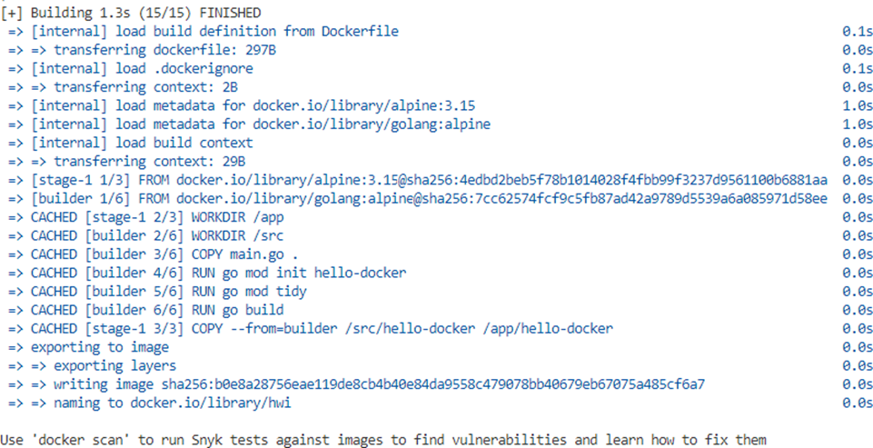

# Методические материалы по темам «Контейнеризации и оркестровки контейнеров» с использованием технологической платформы ПАО «Ростелеком»

## Результаты обучения

В результате проведения практических работ по темам «Контейнеризации и оркестровки контейнеров» осуществляется проверка и формирование нижеследующих умений и знаний.

### Результаты обучения: умения, знания

**Уметь:**

- Управлять ресурсами технологической платформы ПАО «Ростелеком»
- устанавливать и сопровождать системы контейнеризации;
- выполнять оптимизацию системы в зависимости от поставленных задач;

**Знать:**

- порядок настройки виртуальной машины через пользовательский интерфейс технологической платформы ПАО «Ростелеком»
- порядок установки Docker, Docker compose;
- последовательность запуска контейнера на основе Image;
- настройки Volumes;
- настройка Network drivers;
- сборка образов;
- безопасность контейнеров;
- способы подключения к кластеру Kubernetes;
- запуск контейнеров в Kubernetes.

### Критерии оценки

- полнота выполнения задания;
- качество оформления отчёта;
- правильность ответов на контрольные вопросы.

## Настраиваем репозиторий

Обновите apt индекс пакетов и установите пакеты, чтобы разрешить apt использование репозитория через HTTPS:

```bash
sudo apt-get update
```

```bash
sudo apt-get install ca-certificates curl gnupg lsb-release
```

Добавьте официальный GPG-ключ Docker:

```bash
curl -fsSL https://download.docker.com/linux/ubuntu/gpg | sudo gpg --dearmor -o /usr/share/keyrings/docker-archive-keyring.gpg
```

Добавление репозитория

```bash
echo \
  "deb [arch=$(dpkg --print-architecture) signed-by=/usr/share/keyrings/docker-archive-keyring.gpg] https://download.docker.com/linux/ubuntu \
  $(lsb_release -cs) stable" | sudo tee /etc/apt/sources.list.d/docker.list > /dev/null
```

## Установите Engine Docker

Обновите apt индекс пакета и установите последнюю версию Docker Engine, containerd и Docker Compose:

```bash
sudo apt-get update
```

```bash
sudo apt-get install docker-ce docker-ce-cli containerd.io docker-compose-plugin
```

Убедитесь, что Docker Engine установлен правильно, запустив hello-world образ.

```bash
sudo docker run hello-world
```

```bash
Unable to find image 'hello-world:latest' locally
latest: Pulling from library/hello-world
17eec7bbc9d7: Pull complete
Digest: sha256:56433a6be389fb548eaed0d7c2656121b911198df065
Status: Downloaded newer image for hello-world:latest

Hello from Docker!
This message shows that your installation appears to be working correctly.

To generate this message, Docker took the following steps:
 1. The Docker client contacted the Docker daemon.
 2. The Docker daemon pulled the "hello-world" image from the Docker Hub.
    (amd64)
 3. The Docker daemon created a new container from that image which runs the
    executable that produces the output you are currently reading.
 4. The Docker daemon streamed that output to the Docker client, which sent it
    to your terminal.

To try something more ambitious, you can run an Ubuntu container with:
 $ docker run -it ubuntu bash

Share images, automate workflows, and more with a free Docker ID:
 https://hub.docker.com/

For more examples and ideas, visit:
 https://docs.docker.com/get-started/
```

Эта команда загружает тестовый образ и запускает его в контейнере. Когда контейнер запускается, он печатает сообщение и завершает работу.

Теперь выполните `docker ps -a` что бы увидеть все контейнеры в системе.

```bash
sudo docker ps -a
```

Вы увидите ваш hello-world контейнер в списке, выведенном командой `docker ps -a`.

Команда `docker ps` отображает только запущенные контейнеры. Поскольку hello-world уже выполнен и завершен, то соответствующий контейнер не отображается по команде docker ps.

| CONTAINER ID | IMAGE       | COMMAND  | CREATED        | STATUS                    | PORTS | NAMES   |
| ------------ | ----------- | -------- | -------------- | ------------------------- | ----- | ------- |
| 592376ff3eb8 | hello-world | "/hello" | 25 seconds ago | Exited (0) 24 seconds ago |       | no name |

## Сборка и оптимизация образов на основе Dockerfile

Для выполнения этого задания нужно установить docker-compose

**[МЕСТО ДЛЯ ИЗОБРАЖЕНИЯ 5]**

Создаем директорию hello-docker

Создаем в ней два файла:

**main.go:**

```bash
package main

import (
  "fmt"
  "net/http"
  "github.com/sirupsen/logrus"
)

func handle(w http.ResponseWriter, r *http.Request) {
  fmt.Fprintln(w, "Hello docker!")
}

func main() {
  logrus.Info("App run")
  if err := http.ListenAndServe(":8080", http.HandlerFunc(handle)); err != nil {
    logrus.Error(err)
  }
}
```

**Dockerfile:**

```bash
  FROM golang:alpine AS builder
  WORKDIR /src
  COPY main.go .
  RUN go mod init hello-docker
  RUN go mod tidy
  RUN go build
  FROM alpine:3.15
  WORKDIR /app
  COPY --from=builder /src/hello-docker /app/hello-docker
  EXPOSE 8080
  ENTRYPOINT ["/app/hello-docker"]
```

Производим сборку:

```bash
sudo docker build . -t hwi
```



Запускаем собранный образ

**[МЕСТО ДЛЯ ИЗОБРАЖЕНИЯ 9]**

Проверяем доступность запущенного приложеня

**[МЕСТО ДЛЯ ИЗОБРАЖЕНИЯ 10]**

Для сравнения размеров образов полученного приложения и образа со средой компиляции приложения go выполним следующую сборку:

```bash
$ docker build --target builder . -t hwi-intermediate
```

**[МЕСТО ДЛЯ ИЗОБРАЖЕНИЯ 11]**

Теперь сравним размеры образов

**[МЕСТО ДЛЯ ИЗОБРАЖЕНИЯ 12]**

```bash
$ docker image ls | grep | hwi
```

| Image            | Tag    | Image ID     | Created        | Size  |
| ---------------- | ------ | ------------ | -------------- | ----- |
| hwi              | latest | b0e8a28756ea | 42 minutes ago | 12MB  |
| hwi-intermediate | latest | ac4dac42fc7e | 2 hours ago    | 349MB |

## Запуск docker-compose с применением различных Network drivers в docker

Создаем директорию networks

В директории создаем следующие директории:

**[МЕСТО ДЛЯ ИЗОБРАЖЕНИЯ 13]**

В директориях создаем следующие файлы:

**Docker-compose.ymal:**

**[МЕСТО ДЛЯ ИЗОБРАЖЕНИЯ 14]**

**[МЕСТО ДЛЯ ИЗОБРАЖЕНИЯ 15]**

**[МЕСТО ДЛЯ ИЗОБРАЖЕНИЯ 16]**

**code/index.php:**

**[МЕСТО ДЛЯ ИЗОБРАЖЕНИЯ 17]**

**docker/nginx/site.conf:**

```nginx
server {
```

**[МЕСТО ДЛЯ ИЗОБРАЖЕНИЯ 18]**

**docker/php-fpm/Dockerfile:**

**[МЕСТО ДЛЯ ИЗОБРАЖЕНИЯ 19]**

**docker/php-fpm/php.ini:**

**[МЕСТО ДЛЯ ИЗОБРАЖЕНИЯ 20]**

Запускаем сборку:

**[МЕСТО ДЛЯ ИЗОБРАЖЕНИЯ 21]**

Подождем этап сборки и запуска приложений в контейнерах:

**[МЕСТО ДЛЯ ИЗОБРАЖЕНИЯ 22]**

```
=> => sha256:78fdfd2598e0ffdaa39011b909e2a79a75a60a0a87998f1072ec5d9256f19868 225B / 225B | 0.4s
=> => sha256:26769c8659f467675c0f34948c16e051ea7aab69ec3198c65063c299b9771a05 91.60MB / 91.60MB | 18.3s
=> => sha256:bdaf6fac8dceba28623cd6b0f4d8b8ea66c7fbbb234838f05a3eb6bfe083e69c 2.41kB / 2.41kB | 0.0s
=> => sha256:2bd77e634ff6f1ca51fe0acbc5a57a231a5c35563c3cfd474e81eb160350d0f9 11.38kB / 11.38kB | 0.0s
=> => sha256:4c6b8927a4757797e7e6d3e159cf5ec7f1c14171758b442aeac1f6ee3244d926 1.86kB / 1.86kB | 0.0s
=> => sha256:b85a868b505ffd0342a37e6a3b1c49f7c71878afe569a807e6238ef08252fcb7 31.38MB / 31.38MB | 5.1s
=> => sha256:0bd105fadbe34a7e12eb66c424bd0de4b9c2c5c2daf01063eef044ff10e5e437 271B / 271B | 0.8s
=> => sha256:2fadb39daff2b705ef90885be71ba6dace3eec5dac380662c17bff9c50714687 10.74MB / 10.74MB | 5.4s
=> => sha256:acf0bff511002457219f797053d37f627e32240061fd4ecd4c18dd01901a8950 495B / 495B | 5.6s
=> => extracting sha256:b85a868b505ffd0342a37e6a3b1c49f7c71878afe569a807e6238ef08252fcb7 | 6.9s
=> => sha256:402939ef1cc5a8c6bad9733a05f9ca1593f003e96bdf21c816d354153ea38c34 25.40MB / 25.40MB | 14.9s
=> => sha256:6886d213a86f3c3fe28e21ccb352853d2b49bf867e4bb1c4ac56e0ca33da18b7 2.45kB / 2.45kB | 6.0s
=> => sha256:89cb460f70a117898c9979657d357df8262a7d1e4ea0d56f08b97297b0f69eb6 244B / 244B | 6.8s
=> => sha256:4fdf0d4fa32467559369089c9ca0e7249dc9e46b69d85c10ff6a65246e46e94f 8.45kB / 8.45kB | 7.4s
=> => extracting sha256:78fdfd2598e0ffdaa39011b909e2a79a75a60a0a87998f1072ec5d9256f19868 | 0.0s
=> => extracting sha256:26769c8659f467675c0f34948c16e051ea7aab69ec3198c65063c299b9771a05 | 10.1s
=> => extracting sha256:0bd105fadbe34a7e12eb66c424bd0de4b9c2c5c2daf01063eef044ff10e5e437 | 0.0s
=> => extracting sha256:2fadb39daff2b705ef90885be71ba6dace3eec5dac380662c17bff9c50714687 | 0.2s
=> => extracting sha256:acf0bff511002457219f797053d37f627e32240061fd4ecd4c18dd01901a8950 | 0.0s
=> => extracting sha256:402939ef1cc5a8c6bad9733a05f9ca1593f003e96bdf21c816d354153ea38c34 | 2.9s
=> => extracting sha256:6886d213a86f3c3fe28e21ccb352853d2b49bf867e4bb1c4ac56e0ca33da18b7 | 0.0s
=> => extracting sha256:89cb460f70a117898c9979657d357df8262a7d1e4ea0d56f08b97297b0f69eb6 | 0.0s
=> => extracting sha256:4fdf0d4fa32467559369089c9ca0e7249dc9e46b69d85c10ff6a65246e46e94f | 0.0s
=> [2/3] RUN pecl install xdebug-2.9.1 && docker-php-ext-enable xdebug | 42.8s
=> [3/3] RUN docker-php-ext-install pdo_mysql | 19.3s
=> exporting to image | 0.7s
=> => exporting layers | 0.4s
=> => writing image sha256:c6efbcfafd1752a062cdda8871025301bce783fbcd947d6048dd25bc86aabbc8 | 0.0s
=> => naming to docker.io/library/2-live-networks_php | 0.0s


Use 'docker scan' to run Snyk tests against images to find vulnerabilities and learn how to fix them
[+] Running 4/4
Network 2-live-networks_default Created 0.6s


Container 2-live-networks-php-1 Created 2.1s
Container 2-live-networks-nginx-1 Created 1.8s
Container 2-live-networks-db-1 Created 2.1s
Attaching to 2-live-networks-db-1, 2-live-networks-nginx-1, 2-live-networks-php-1
2-live-networks-db-1 | 2022-06-23 17:27:43+00:00 [Note] [Entrypoint]: Entrypoint script for MySQL Server 8.0.29-1debian10 started.
2-live-networks-php-1 | [23-Jun-2022 17:27:44] NOTICE: fpm is running, pid 1
2-live-networks-php-1 | [23-Jun-2022 17:27:44] NOTICE: ready to handle connections
2-live-networks-db-1 | 2022-06-23 17:27:45+00:00 [Note] [Entrypoint]: Switching to dedicated user 'mysql'
2-live-networks-db-1 | 2022-06-23 17:27:45+00:00 [Note] [Entrypoint]: Entrypoint script for MySQL Server 8.0.29-1debian10 started.
2-live-networks-db-1 | 2022-06-23 17:27:45+00:00 [Note] [Entrypoint]: Initializing database files
2-live-networks-db-1 | 2022-06-23T17:27:45.646119Z 0 [System] [MY-013169] [Server] /usr/sbin/mysqld (mysqld 8.0.29) initializing of server in progress as process 44
2-live-networks-db-1 | 2022-06-23T17:27:45.703261Z 0 [Warning] [MY-010159] [Server] Setting lower_case_table_names=2 because file system for /var/lib/mysql/ is case insensitive
2-live-networks-db-1 | 2022-06-23T17:27:45.817354Z 1 [System] [MY-013576] [InnoDB] InnoDB initialization has started.
2-live-networks-db-1 | 2022-06-23T17:27:52.307662Z 1 [System] [MY-013577] [InnoDB] InnoDB initialization has ended.
2-live-networks-db-1 | 2022-06-23T17:28:02.416249Z 6 [Warning] [MY-010453] [Server] root@localhost is created with an empty password ! Please consider switching off the --initialize-insecure option.
2-live-networks-db-1 | 2022-06-23 17:28:20+00:00 [Note] [Entrypoint]: Database files initialized
2-live-networks-db-1 | 2022-06-23 17:28:20+00:00 [Note] [Entrypoint]: Starting temporary server


2-live-networks-db-1 | 2022-06-23T17:28:20.784151Z 0 [System] [MY-010116] [Server] /usr/sbin/mysqld (mysqld 8.0.29) starting as process 93
2-live-networks-db-1 | 2022-06-23T17:28:20.799480Z 0 [Warning] [MY-010159] [Server] Setting lower_case_table_names=2 because file system for /var/lib/mysql/ is case insensitive
2-live-networks-db-1 | 2022-06-23T17:28:20.853460Z 1 [System] [MY-013576] [InnoDB] InnoDB initialization has started.
2-live-networks-db-1 | 2022-06-23T17:28:22.495678Z 1 [System] [MY-013577] [InnoDB] InnoDB initialization has ended.
2-live-networks-db-1 | 2022-06-23T17:28:23.987921Z 0 [Warning] [MY-010068] [Server] CA certificate ca.pem is self signed.
2-live-networks-db-1 | 2022-06-23T17:28:23.988803Z 0 [System] [MY-013602] [Server] Channel mysql_main configured to support TLS. Encrypted connections are now supported for this channel.
2-live-networks-db-1 | 2022-06-23T17:28:24.048946Z 0 [Warning] [MY-011810] [Server] Insecure configuration for --pid-file: Location '/var/run/mysqld' in the path is accessible to all OS users. Consider choosing a different directory.
2-live-networks-db-1 | 2022-06-23T17:28:24.220678Z 0 [System] [MY-011323] [Server] X Plugin ready for connections. Socket: /var/run/mysqld/mysqlx.sock
2-live-networks-db-1 | 2022-06-23T17:28:24.224287Z 0 [System] [MY-010931] [Server] /usr/sbin/mysqld: ready for connections. Version: '8.0.29' socket: '/var/run/mysqld/mysqld.sock' port: 0 MySQL Community Server - GPL.
2-live-networks-db-1 | 2022-06-23 17:28:24+00:00 [Note] [Entrypoint]: Temporary server started.
2-live-networks-db-1 | Warning: Unable to load '/usr/share/zoneinfo/iso3166.tab' as time zone. Skipping it.
2-live-networks-db-1 | Warning: Unable to load '/usr/share/zoneinfo/leap-seconds.list' as time zone. Skipping it.
2-live-networks-db-1 | Warning: Unable to load '/usr/share/zoneinfo/zone.tab' as time zone. Skipping it.


2-live-networks-db-1 | Warning: Unable to load '/usr/share/zoneinfo/zone1970.tab' as time zone. Skipping it.
2-live-networks-db-1 | 2022-06-23 17:28:34+00:00 [Note] [Entrypoint]: Creating database base
2-live-networks-db-1 | 2022-06-23 17:28:34+00:00 [Note] [Entrypoint]: Creating user user
2-live-networks-db-1 | 2022-06-23 17:28:34+00:00 [Note] [Entrypoint]: Giving user user access to schema base
2-live-networks-db-1 |
2-live-networks-db-1 | 2022-06-23 17:28:34+00:00 [Note] [Entrypoint]: Stopping temporary server
2-live-networks-db-1 | 2022-06-23T17:28:34.642435Z 13 [System] [MY-013172] [Server] Received SHUTDOWN from user root. Shutting down mysqld (Version: 8.0.29).
2-live-networks-db-1 | 2022-06-23T17:28:37.759863Z 0 [System] [MY-010910] [Server] /usr/sbin/mysqld: Shutdown complete (mysqld 8.0.29) MySQL Community Server - GPL.
2-live-networks-db-1 | 2022-06-23 17:28:38+00:00 [Note] [Entrypoint]: Temporary server stopped
2-live-networks-db-1 |
2-live-networks-db-1 | 2022-06-23 17:28:38+00:00 [Note] [Entrypoint]: MySQL init process done. Ready for start up.
2-live-networks-db-1 |
2-live-networks-db-1 | 2022-06-23T17:28:39.070794Z 0 [System] [MY-010116] [Server] /usr/sbin/mysqld (mysqld 8.0.29) starting as process 1
2-live-networks-db-1 | 2022-06-23T17:28:39.104767Z 0 [Warning] [MY-010159] [Server] Setting lower_case_table_names=2 because file system for /var/lib/mysql/ is case insensitive
2-live-networks-db-1 | 2022-06-23T17:28:39.204213Z 1 [System] [MY-013576] [InnoDB] InnoDB initialization has started.
2-live-networks-db-1 | 2022-06-23T17:28:45.766135Z 1 [System] [MY-013577] [InnoDB] InnoDB initialization has ended.


2-live-networks-db-1 | 2022-06-23T17:28:48.968577Z 0 [Warning] [MY-010068] [Server] CA certificate ca.pem is self signed.
2-live-networks-db-1 | 2022-06-23T17:28:48.971560Z 0 [System] [MY-013602] [Server] Channel mysql_main configured to support TLS. Encrypted connections are now supported for this channel.
2-live-networks-db-1 | 2022-06-23T17:28:49.269435Z 0 [Warning] [MY-011810] [Server] Insecure configuration for --pid-file: Location '/var/run/mysqld' in the path is accessible to all OS users. Consider choosing a different directory.
2-live-networks-db-1 | 2022-06-23T17:28:49.684209Z 0 [System] [MY-011323] [Server] X Plugin ready for connections. Bind-address: '::' port: 33060, socket: /var/run/mysqld/mysqlx.sock
2-live-networks-db-1 | 2022-06-23T17:28:49.684301Z 0 [System] [MY-010931] [Server] /usr/sbin/mysqld: ready for connections. Version: '8.0.29' socket: '/var/run/mysqld/mysqld.sock' port: 3306 MySQL Community Server - GPL.
```

Проверяем запуск наших контейнеров:

```bash
$ docker ps
```

**[МЕСТО ДЛЯ ИЗОБРАЖЕНИЯ 23]**

Проинспектируем созданные сети:

**[МЕСТО ДЛЯ ИЗОБРАЖЕНИЯ 24]**

| NETWORK ID   | NAME                    | DRIVER | SCOPE |
| ------------ | ----------------------- | ------ | ----- |
| bb0141995383 | 2-live-networks_default | bridge | local |
| 0507ad46874b | bridge                  | bridge | local |
| 3ceb0f16d293 | host                    | host   | local |
| 2a3f49dae137 | none                    | null   | local |

Остановим наши контейнеры Ctrl+C

Модифицируем файл **Docker-compose.ymal:**

**[МЕСТО ДЛЯ ИЗОБРАЖЕНИЯ 25]**

**[МЕСТО ДЛЯ ИЗОБРАЖЕНИЯ 26]**

**[МЕСТО ДЛЯ ИЗОБРАЖЕНИЯ 27]**

Добавили в каждый блок описания сервиса `network_mode: none`

Запускаем наши контейнеры `$ docker-compose up`

**[МЕСТО ДЛЯ ИЗОБРАЖЕНИЯ 28]**

Видим, что контейнер nginx не запустился.

Проверяем какие контейнеры запущены и обращаем внимание на то, что в этот раз порты никакие не используются:

```bash
$ docker ps
```

**[МЕСТО ДЛЯ ИЗОБРАЖЕНИЯ 29]**

Проинспектируем network drivers:

**[МЕСТО ДЛЯ ИЗОБРАЖЕНИЯ 30]**

```json
"Attachable": false,
"Ingress": false,
"ConfigFrom": {
    "Network": ""
},
"ConfigOnly": false,
"Containers": {
    "5dea4983319a30c0ee6d60a787b0f14e00ad55c112e8934676eebe0ed9f9cfe9": {
        "Name": "2-live-networks-db-1",
        "EndpointID": "4c686ea32adcb78fe939165027fbd46df4f255109fecc0513dd18ac578b38f4a",
        "MacAddress": "",
        "IPv4Address": "",
        "IPv6Address": ""
    },
    "a76759d35789864d8de8cf2b2f76b43968284fd18f676b293dc1f9b6c05ca473": {
        "Name": "2-live-networks-php-1",
        "EndpointID": "d815d5f548eb9a0ea1feacfbe2e03331f0852c92d5d7bcf14126eb9e273fc29e",
        "MacAddress": "",
        "IPv4Address": "",
        "IPv6Address": ""
    }
},
"Options": {},
"Labels": {}
```

Видим, что в такой конфигурации, когда контейнеры изолированы nginx не может запуститься.

Модифицируем наш файл **Docker-compose.ymal:**

```yaml
version: "3"

services:
  nginx:
    image: nginx:1.17.8
    ports:
      - "8080:80"
    volumes:
      - ./code:/code
      - ./docker/nginx/site.conf:/etc/nginx/conf.d/site.conf
    networks:
      - test-network

  php:
    build:
      context: docker/php-fpm
    volumes:
      - ./code:/code
      - ./docker/php-fpm/php.ini:/usr/local/etc/php/php.ini
    networks:
      - test-network

  db:
    image: mysql:8.0
    restart: always
    environment:
      MYSQL_DATABASE: "base"
      MYSQL_USER: "user"
      MYSQL_PASSWORD: "12345"
      MYSQL_ROOT_PASSWORD: "root"
    volumes:
```

**[МЕСТО ДЛЯ ИЗОБРАЖЕНИЯ 31]**

Добавляем в него описание network drivers bridge

Запускаем контейнеры `$ docker-compose up`

Проверяем количество запущенных контейнеров:

```bash
$ docker ps
```

**[МЕСТО ДЛЯ ИЗОБРАЖЕНИЯ 32]**

Должно отобразиться три запущенных контейнера.

Посмотрим наши сети:

**[МЕСТО ДЛЯ ИЗОБРАЖЕНИЯ 33]**

| NETWORK ID   | NAME                         | DRIVER | SCOPE |
| ------------ | ---------------------------- | ------ | ----- |
| bb0141995383 | 2-live-networks_default      | bridge | local |
| 79a9d5184f94 | 2-live-networks_test-network | bridge | local |
| 0507ad46874b | bridge                       | bridge | local |
| 3ceb0f16d293 | host                         | host   | local |
| 2a3f49dae137 | none                         | null   | local |

Видим нашу сеть 2-live-networks_test-network с драйвером bridge.

Теперь проинспектируем нашу сеть:

```bash
$ docker network inspect 2-live-networks_test-network
```

```json
[
  {
    "Name": "2-live-networks_test-network",
    "Id": "79a9d5184f94c77b8bd49362176cf7a0b902744753d988b9198c195591d84e69",
    "Created": "2022-06-23T17:59:02.9531594Z",
    "Scope": "local",
    "Driver": "bridge",
    "EnableIPv6": false,
    "IPAM": {
      "Driver": "default",
      "Options": null,
      "Config": [
        {
          "Subnet": "172.19.0.0/16",
          "Gateway": "172.19.0.1"
        }
      ]
    },
    "Internal": false,
    "Attachable": false,
    "Ingress": false,
    "ConfigFrom": {
      "Network": ""
    },
    "ConfigOnly": false,
    "Containers": {
      "71d01f006bab7dd6f86290d6a65b7a31e81a4e32d2098a0834b1de977910db24": {
        "Name": "2-live-networks-nginx-1",
        "EndpointID": "dc6b2535cc65eb37049295fb0453c25326c1f0c75db7727d8ad84e9b78d5dc25",
        "MacAddress": "02:42:ac:13:00:04"
      }
    }
  }
]
```

Обратим внимание, что каждому контейнеру присвоены IP адреса.

Теперь добавим в секции networks описание IP адресов

**[МЕСТО ДЛЯ ИЗОБРАЖЕНИЯ 34]**

Запуск контейнеров с новой конфигурацией нужно производить после выполнения команды `docker-compose down`

Мы же воспользуемся «агрессивном» способом с описанием последствий и способа решения возникшей проблемы.

Останавливаем наши контейнеры Ctrl+C.

**[МЕСТО ДЛЯ ИЗОБРАЖЕНИЯ 35]**

Из списка сетей копируем имя нашей сети и вставляем ее в команду:

**[МЕСТО ДЛЯ ИЗОБРАЖЕНИЯ 36]**

Проверяем, что сеть удалена:

**[МЕСТО ДЛЯ ИЗОБРАЖЕНИЯ 37]**

| NETWORK ID   | NAME                    | DRIVER | SCOPE |
| ------------ | ----------------------- | ------ | ----- |
| bb0141995383 | 2-live-networks_default | bridge | local |
| 0507ad46874b | bridge                  | bridge | local |
| 3ceb0f16d293 | host                    | host   | local |
| 2a3f49dae137 | none                    | null   | local |

Пробуем запустить наши контейнеры:

```bash
$ docker-compose up
```

И видим ошибку:

**[МЕСТО ДЛЯ ИЗОБРАЖЕНИЯ 38]**

Чтобы ее исправить запускаем ниши контейнеры с флагом `--force-recreate`

**[МЕСТО ДЛЯ ИЗОБРАЖЕНИЯ 39]**

Проверим список сетей и проинспектируем нашу сеть и убедимся, что применилась наша конфигурация.

**[МЕСТО ДЛЯ ИЗОБРАЖЕНИЯ 40]**

| NETWORK ID   | NAME                         | DRIVER | SCOPE |
| ------------ | ---------------------------- | ------ | ----- |
| bb0141995383 | 2-live-networks_default      | bridge | local |
| 113b81a2c1a9 | 2-live-networks_test-network | bridge | local |
| 0507ad46874b | bridge                       | bridge | local |
| 3ceb0f16d293 | host                         | host   | local |
| 2a3f49dae137 | none                         | null   | local |

**[МЕСТО ДЛЯ ИЗОБРАЖЕНИЯ 41]**

```json
"Subnet": "192.168.110.0/24"
```

```json
"Internal": false,
"Attachable": false,
"Ingress": false,
"ConfigFrom": {
  "Network": ""
},
"ConfigOnly": false,
"Containers": {
  "b40a0e59fcb6888628b85346eee609aae533782f70295118cca52232e87e9345": {
    "Name": "2-live-networks-php-1",
    "EndpointID": "b32865407c8d1bfcc89a3dd6474f65a022ffa08a74d44990b289545984864a01",
    "MacAddress": "02:42:c0:a8:6e:02",
    "IPv4Address": "192.168.110.2/24",
    "IPv6Address": ""
  },
  "b492b1c207120819e84c42a72316cc8e6c7897d80650a118716371b5a64c20a9": {
    "Name": "2-live-networks-db-1",
    "EndpointID": "00d6777bdf89f7f3726bf154cf1408e26497e30226be4d277e4829f6544c80c8",
    "MacAddress": "02:42:c0:a8:6e:03",
    "IPv4Address": "192.168.110.3/24",
    "IPv6Address": ""
  },
  "e67535d50a330ebc9c6aa7d313c852bb7185530a2cddf78edc3aad5ff2032c00": {
    "Name": "2-live-networks-nginx-1",
    "EndpointID": "6c86108a7bbd557f34d1e2c077db002a11c160dc8e543d42226686868a7679c5",
    "MacAddress": "02:42:c0:a8:6e:04",
    "IPv4Address": "192.168.110.4/24",
    "IPv6Address": ""
  }
}
```

## Построение информационной безопасности контейнеров

Запускаем контейнеры командой:

**[МЕСТО ДЛЯ ИЗОБРАЖЕНИЯ 42]**

Дождемся загрузки и разворачивания контейнеров. Проверяем, что контейнер запущен:

**[МЕСТО ДЛЯ ИЗОБРАЖЕНИЯ 43]**

Зайдем «внутрь» контейнера:

**[МЕСТО ДЛЯ ИЗОБРАЖЕНИЯ 44]**

Смотрим из-под какого пользователя мы зашли:

**[МЕСТО ДЛЯ ИЗОБРАЖЕНИЯ 45]**

Выведем список всех пользователей:

**[МЕСТО ДЛЯ ИЗОБРАЖЕНИЯ 46]**

```
root:x:0:0:root:/root:/bin/bash
daemon:x:1:1:daemon:/usr/sbin:/usr/sbin/nologin
bin:x:2:2:bin:/bin:/usr/sbin/nologin
sys:x:3:3:sys:/dev:/usr/sbin/nologin
sync:x:4:65534:sync:/bin:/bin/sync
games:x:5:60:games:/usr/games:/usr/sbin/nologin
man:x:6:12:man:/var/cache/man:/usr/sbin/nologin
lp:x:7:7:lp:/var/spool/lpd:/usr/sbin/nologin
mail:x:8:8:mail:/var/mail:/usr/sbin/nologin
news:x:9:9:news:/var/spool/news:/usr/sbin/nologin
uucp:x:10:10:uucp:/var/spool/uucp:/usr/sbin/nologin
proxy:x:13:13:proxy:/bin:/usr/sbin/nologin
www-data:x:33:33:www-data:/var/www:/usr/sbin/nologin
backup:x:34:34:backup:/var/backups:/usr/sbin/nologin
list:x:38:38:Mailing List Manager:/var/list:/usr/sbin/nologin
irc:x:39:39:ircd:/run/ircd:/usr/sbin/nologin
gnats:x:41:41:Gnats Bug-Reporting System (admin):/var/lib/gnats:/usr/sbin/nologin
nobody:x:65534:65534:nobody:/nonexistent:/usr/sbin/nologin
_apt:x:100:65534::/nonexistent:/usr/sbin/nologin
mysql:x:999:999::/home/mysql:/bin/sh
```

Видим, что среди пользователей есть пользователь mysql 999

Выходим из shell командой exit. Останавливаем контейнер и удаляем его

**[МЕСТО ДЛЯ ИЗОБРАЖЕНИЯ 47]**

Запускаем контейнер с флагом -u(user) 999

**[МЕСТО ДЛЯ ИЗОБРАЖЕНИЯ 48]**

Смотрим под каким пользователем теперь зашли и сможем ли мы перейти в каталог root?

**[МЕСТО ДЛЯ ИЗОБРАЖЕНИЯ 49]**

**[МЕСТО ДЛЯ ИЗОБРАЖЕНИЯ 50]**

**[МЕСТО ДЛЯ ИЗОБРАЖЕНИЯ 51]**

```bash
$ exit
```

Останавливаем контейнер и удаляем его

**[МЕСТО ДЛЯ ИЗОБРАЖЕНИЯ 52]**

Теперь убедимся, что при стандартном запуске контейнера мы не сможем, например, удалить сетевой интерфейс.

**[МЕСТО ДЛЯ ИЗОБРАЖЕНИЯ 53]**

```bash
docker exec -ti mariadb sh
```

**[МЕСТО ДЛЯ ИЗОБРАЖЕНИЯ 54]**

**[МЕСТО ДЛЯ ИЗОБРАЖЕНИЯ 55]**

Запустим контейнер с ключом `--privileged` и убедимся, что теперь сможем удалить сетевой интерфейс:

**[МЕСТО ДЛЯ ИЗОБРАЖЕНИЯ 56]**

**[МЕСТО ДЛЯ ИЗОБРАЖЕНИЯ 57]**

**[МЕСТО ДЛЯ ИЗОБРАЖЕНИЯ 58]**

## Запуск контейнеров mariadb+adminer в kubernetes

Запускаем mariadb

**[МЕСТО ДЛЯ ИЗОБРАЖЕНИЯ 59]**

Запускаем adminer

**[МЕСТО ДЛЯ ИЗОБРАЖЕНИЯ 60]**

Открываем «межподовое» взаимодействие

**[МЕСТО ДЛЯ ИЗОБРАЖЕНИЯ 61]**

**[МЕСТО ДЛЯ ИЗОБРАЖЕНИЯ 62]**

Проверим список запущенных подов

**[МЕСТО ДЛЯ ИЗОБРАЖЕНИЯ 63]**

| NAME    | READY | STATUS  | RESTARTS | AGE   |
| ------- | ----- | ------- | -------- | ----- |
| adminer | 1/1   | Running | 0        | 5m11s |

Проверим список запущенных сервисов

**[МЕСТО ДЛЯ ИЗОБРАЖЕНИЯ 64]**

| NAME       | TYPE      | CLUSTER-IP    | EXTERNAL-IP | PORT(S)        | AGE   |
| ---------- | --------- | ------------- | ----------- | -------------- | ----- |
| adminer    | NodePort  | 10.102.229.28 | <none>      | 8080:32225/TCP | 96s   |
| kubernetes | ClusterIP | 10.96.0.1     | <none>      | 443/TCP        | 7m23s |
| mariadb    | ClusterIP | 10.102.61.247 | <none>      | 3306/TCP       | 2m6s  |

Воспользуемся возможностью локального проброса портов до нужного пода. Выведем список подов с указанием пространства имен:

**[МЕСТО ДЛЯ ИЗОБРАЖЕНИЯ 65]**

| NAMESPACE   | NAME                                 | READY | STATUS  | RESTARTS | AGE |
| ----------- | ------------------------------------ | ----- | ------- | -------- | --- |
| default     | adminer                              | 1/1   | Running | 0        | 26m |
| default     | mariadb                              | 1/1   | Running | 0        | 26m |
| kube-system | coredns-f9fd979d6-fq9js              | 1/1   | Running | 0        | 27m |
| kube-system | coredns-f9fd979d6-tmfpv              | 1/1   | Running | 0        | 27m |
| kube-system | etcd-s122-g264-c1                    | 1/1   | Running | 0        | 27m |
| kube-system | kube-apiserver-s122-g264-c1          | 1/1   | Running | 0        | 27m |
| kube-system | kube-controller-manager-s122-g264-c1 | 1/1   | Running | 0        | 27m |
| kube-system | kube-flannel-ds-8xmsp                | 1/1   | Running | 0        | 27m |
| kube-system | kube-flannel-ds-crrzw                | 1/1   | Running | 0        | 27m |
| kube-system | kube-proxy-4vjlw                     | 1/1   | Running | 0        | 27m |
| kube-system | kube-proxy-xcrgj                     | 1/1   | Running | 0        | 27m |
| kube-system | kube-scheduler-s122-g264-c1          | 1/1   | Running | 0        | 27m |

NAMESPACE, в котором запущен под adminer имеет имя default.

Команда проброса портов будет выглядеть следующим образом:

**[МЕСТО ДЛЯ ИЗОБРАЖЕНИЯ 66]**

Зайдем в браузере по адресу http://localhost:8080/

**[МЕСТО ДЛЯ ИЗОБРАЖЕНИЯ 67]**

Проверяем работу, указывая параметры подключения:

- Сервер: mariadb
- Имя пользователя: root
- Пароль: supperpass

**[МЕСТО ДЛЯ ИЗОБРАЖЕНИЯ 68]**

**[МЕСТО ДЛЯ ИЗОБРАЖЕНИЯ 69]**

## Развертывание инструментов DevOps/DevSecOps в DE k8s-managed-sevice

Используя заранее созданный кластер на платформе DE, скачайте kubeconfig. При выполнении задания используйте утилиту kubectl. При отправке команд, указывайте флаг kubeconfig для передачи токена и адреса подключения к кластеру DE k8s-managed-sevice

```bash
kubectl get nodes --kubeconfig='<путь-до-kubeconfig>'
```

### Инсталяция инструмента MobSF

Создайте неймспейс для инструмента MobSF

```bash
kubectl create ns mobsf
```

Создайте deployment Mobsf

```bash
kubectl create deployment mobsf --image=opensecurity/mobile-security-framework-mobsf:v3.1.1 -n mobsf
```

(деплоймент позволяет отслеживать количество подов и сервисов, выполнять их обновление и модификацию)

Создайте службу для пода MobSF

```bash
kubectl expose deployment mobsf --port=8000 --type=NodePort -n mobsf
```

Если вы используете ингресс-контроллер для обработки входящих соединений в кластере, узнайте его external-ip

```bash
kubectl get svc -n kube-system
```

Узнайте, какой порт на хосте был выделен службы MobSF

```bash
kubectl get svc -n mobsf
```

Используя браузер, перейдите по адресу (ip:port) и откройте веб-интерфейс MobSF

```
http://172.26.0.3:31278
```

### Инсталяция инструмента Istio, плагинов, применение модифицирующего вебхука к инструменту MobSF для развертывания сервисной сетки

Создайте собственный неймспейс для Istio

```bash
kubectl create ns istio-system
```

Проинсталируйте helm (https://helm.sh/docs/intro/install/)

Добавьте репозиторий Istio в Helm

```bash
helm repo add istio https://istio-release.storage.googleapis.com/charts
```

Выполните апдейт репозиториев

```bash
helm repo update
```

Проинсталируйте базовые компоненты сервисной сетки Istio с помощью HELM

```bash
helm install istio-base istio/base -n istio-system
helm install istiod istio/istiod -n istio-system --wait
```

Проинсталируйте интегрированный в Istio дашборд Kiali через плагин

```bash
kubectl apply -f https://raw.githubusercontent.com/istio/istio/release-1.13/samples/addons/kiali.yaml
```

Модифицируйте манифест проинсталированной службы Kiali

```bash
kubectl edit svc kiali -n istio-system
```

учимся модифицировать манифест: ищем в спецификации `type: ClusterIP` и меняем его на `type: NodePort`

тем самым используя сеть хоста

сохраняем изменения, получаем уведомление, что service/kiali edited

Проинсталлируйте интегрированный в Istio интегрированный инструмент по сбору метрик Prometheus через плагин

```bash
kubectl apply -f https://raw.githubusercontent.com/istio/istio/release-1.13/samples/addons/prometheus.yaml
```

Применяем модицифирующий вебхук к неймспесу с инструментом Mobsf

```bash
kubectl label namespace mobsf istio-injection=enabled
```

получаем уведомление, что namespace/mobsf labeled

Получаем информацию о поде с инструментом MobSF

```bash
kubectl get pods -n mobsf
```

Удаляем под с MobSf

```bash
kubectl delete pod mobsf-5db69649fc-5nl7t -n mobsf
```

(обратите внимание, что в вашем случае будет другое наименование пода, подставьте свое значения из вывода команды `kubectl get pods -n mobsf`)

поскольку мы с вами создавали deployment для mobsf, удаление пода вызовет ее переразвертывание (но уже с примененным модифицирующим вебхуком от Istio)

вызовите снова команду `kubectl get pods -n mobsf`

и обратите внимание на вывод, в графе READY вы теперь видите "2/2", это означает, что в поде теперь находятся 2 контейнера - один это контейнер с mobsf, второй - это sidecar который внедрился Istio. Sidecar - это контейнер с прокси-сервером Envoy, который будет сообщать Istio о всех действиях контейнера)

Выполните команду и определите, по какому порту запущен дашборд kiali

```bash
kubectl get svc -n istio-system
```

Перейдите по адресу хоста, подставив обнаруженный порт службы kiali. Откроется интерфейс дашборда.

**[МЕСТО ДЛЯ ИЗОБРАЖЕНИЯ 70]**

Отерыв интерфейс дашборда kiali, перейдите в раздел "Graph", выберите namespace Mobsf в выпадающем списке "Select namespaces"

Во временном фильтре в правой верхней части экрана установите вместо "Last 1m" значение "Last 1d"

Перейдите в интерфейс MobSF и выполните имитацию полезной нагрузки (попереключайтесь между вкладками RECENT SCANS и главной страницей несколько раз)

Перейдите обратно в kiali и немного подождите, вы получите визуализацию активности внутри построенной вами сервисной сетки (см. приложенный скриншот "service-mesh-in-action.jpg".

**[МЕСТО ДЛЯ ИЗОБРАЖЕНИЯ 71]**

## Результат успешного выполнения задания:

**[МЕСТО ДЛЯ ИЗОБРАЖЕНИЯ 72]**
