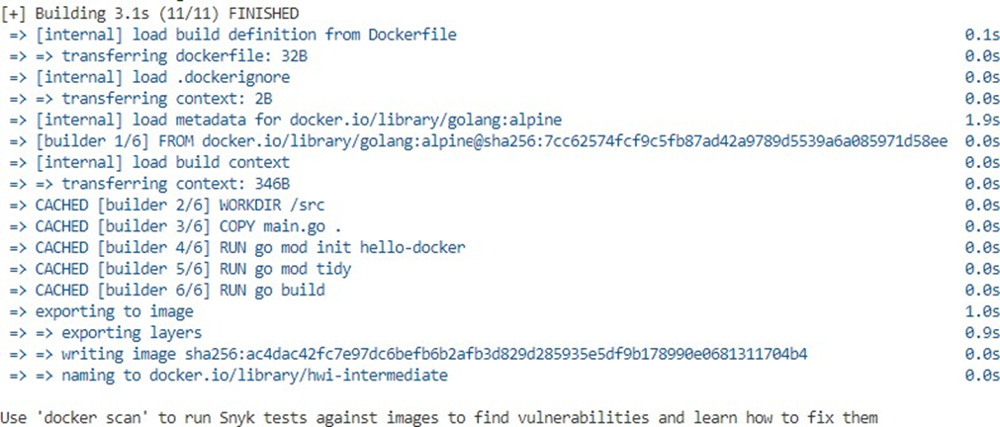
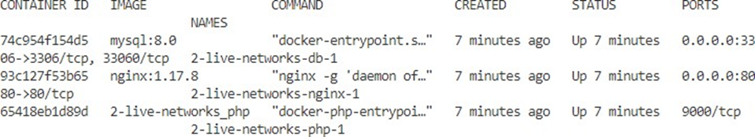
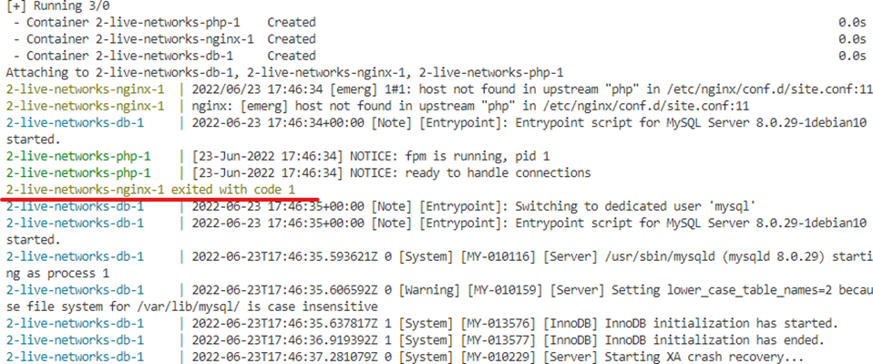
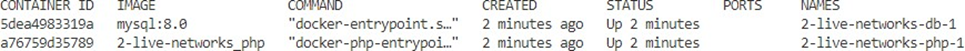
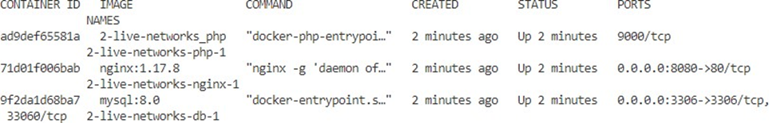
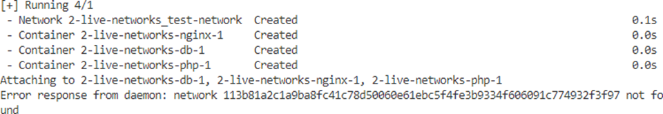

# Методические материалы по темам «Контейнеризации и оркестровки контейнеров»

## Результаты обучения

В результате проведения практических работ по темам «Контейнеризации и оркестровки контейнеров» осуществляется проверка и формирование нижеследующих умений и знаний.

### Результаты обучения: умения, знания

**Уметь:**

- устанавливать и сопровождать системы контейнеризации;
- выполнять оптимизацию системы в зависимости от поставленных задач;

**Знать:**

- порядок установки Docker, Docker compose;
- последовательность запуска контейнера на основе Image;
- настройки Volumes;
- настройка Network drivers;
- сборка образов;
- безопасность контейнеров;

### Критерии оценки

- полнота выполнения задания;
- качество оформления отчёта;
- правильность ответов на контрольные вопросы.

## Настраиваем репозиторий

Обновите apt индекс пакетов и установите пакеты, чтобы разрешить apt использование репозитория через HTTPS:

```bash
sudo apt-get update
```

```bash
sudo apt-get install ca-certificates curl gnupg lsb-release
```

Добавьте официальный GPG-ключ Docker:

```bash
curl -fsSL https://download.docker.com/linux/ubuntu/gpg | sudo gpg --dearmor -o /usr/share/keyrings/docker-archive-keyring.gpg
```

Добавление репозитория

```bash
echo \
  "deb [arch=$(dpkg --print-architecture) signed-by=/usr/share/keyrings/docker-archive-keyring.gpg] https://download.docker.com/linux/ubuntu \
  $(lsb_release -cs) stable" | sudo tee /etc/apt/sources.list.d/docker.list > /dev/null
```

## Установите Docker Engine

Обновите apt индекс пакета и установите последнюю версию Docker Engine, containerd и Docker Compose:

```bash
sudo apt-get update
```

```bash
sudo apt-get install docker-ce docker-ce-cli containerd.io docker-compose-plugin
```

Убедитесь, что Docker Engine установлен правильно, запустив hello-world образ.

```bash
sudo docker run hello-world
```

```
Unable to find image 'hello-world:latest' locally
latest: Pulling from library/hello-world
17eec7bbc9d7: Pull complete
Digest: sha256:56433a6be389fb548eaed0d7c2656121b911198df065
Status: Downloaded newer image for hello-world:latest

Hello from Docker!
This message shows that your installation appears to be working correctly.

To generate this message, Docker took the following steps:
 1. The Docker client contacted the Docker daemon.
 2. The Docker daemon pulled the "hello-world" image from the Docker Hub.
    (amd64)
 3. The Docker daemon created a new container from that image which runs the
    executable that produces the output you are currently reading.
 4. The Docker daemon streamed that output to the Docker client, which sent it
    to your terminal.

To try something more ambitious, you can run an Ubuntu container with:
 $ docker run -it ubuntu bash

Share images, automate workflows, and more with a free Docker ID:
 https://hub.docker.com/

For more examples and ideas, visit:
 https://docs.docker.com/get-started/
```

Эта команда загружает тестовый образ и запускает его в контейнере. Когда контейнер запускается, он печатает сообщение и завершает работу.

Теперь выполните `docker ps -a`, чтобы увидеть все контейнеры в системе.

```bash
sudo docker ps -a
```

Вы увидите ваш hello-world контейнер в списке, выведенном командой `docker ps -a`.

Команда `docker ps` отображает только запущенные контейнеры. Поскольку hello-world уже выполнен и завершён, то соответствующий контейнер не отображается по команде docker ps.

| CONTAINER ID | IMAGE       | COMMAND  | CREATED        | STATUS                    | PORTS | NAMES |
| ------------ | ----------- | -------- | -------------- | ------------------------- | ----- | ----- |
| 592376ff3eb8 | hello-world | "/hello" | 25 seconds ago | Exited (0) 24 seconds ago |       |       |

## Сборка и оптимизация образов на основе Dockerfile

Для выполнения этого задания нужно установить docker-compose

Создаём директорию hello-docker

Создаём в ней два файла:

**main.go:**

```bash
package main

import (
  "fmt"
  "net/http"
  "github.com/sirupsen/logrus"
)

func handle(w http.ResponseWriter, r *http.Request) {
  fmt.Fprintln(w, "Hello docker!")
}

func main() {
  logrus.Info("App run")
  if err := http.ListenAndServe(":8080", http.HandlerFunc(handle)); err != nil {
    logrus.Error(err)
  }
}
```

**Dockerfile:**

```bash
  FROM golang:alpine AS builder
  WORKDIR /src
  COPY main.go .
  RUN go mod init hello-docker
  RUN go mod tidy
  RUN go build
  FROM alpine:3.15
  WORKDIR /app
  COPY --from=builder /src/hello-docker /app/hello-docker
  EXPOSE 8080
  ENTRYPOINT ["/app/hello-docker"]
```

Производим сборку:

```bash
sudo docker build . -t hwi
```


Запускаем собранный образ

```bash
sudo docker run -p 8080:8080 hwi
```

Проверяем доступность запущенного приложения

```bash
curl localhost:8080
```

Должно вывести:

```
Hello docker!
```

Для сравнения размеров образов полученного приложения и образа со средой компиляции приложения go выполним следующую сборку:

```bash
sudo docker build --target builder . -t hwi-intermediate
```



Теперь сравним размеры образов

```bash
sudo docker image ls | grep hwi
```

| Image            | Tag    | Image ID     | Created        | Size  |
| ---------------- | ------ | ------------ | -------------- | ----- |
| hwi              | latest | b0e8a28756ea | 42 minutes ago | 12MB  |
| hwi-intermediate | latest | ac4dac42fc7e | 2 hours ago    | 349MB |

## Запуск docker-compose с применением различных Network drivers в docker

Создаём директорию 2-live-networks

В директории создаём следующие директории:

```bash
mkdir 2-live-networks
```

```bash
cd ./2-live-networks
```

```bash
mkdir code docker docker/nginx docker/php-fpm
```

В директориях создаём следующие файлы:

**docker-compose.yaml:**

```yaml
version: "3"

services:
  nginx:
    image: nginx:1.17.8
    ports:
      - "8080:80"
    volumes:
      - ./code:/code
      - ./docker/nginx/site.conf:/etc/nginx/conf.d/site.conf

  php:
    build:
      context: docker/php-fpm
    volumes:
      - ./code:/code
      - ./docker/php-fpm/php.ini:/usr/local/etc/php/php.ini

  db:
    image: mysql:8.0
    restart: always
    environment:
      MYSQL_DATABASE: "base"
      MYSQL_USER: "user"
      MYSQL_PASSWORD: "12345"
      MYSQL_ROOT_PASSWORD: "root"
    volumes:
      - ./docker/db:/var/lib/mysql
    ports:
      - "3306:3306"
```

**code/index.php:**

```php
<?php
$greetingWord = 'Hello!';
echo '<div>' . $greetingWord . '</div>';
```

**docker/nginx/site.conf:**

```nginx
server {
  index index.php index.html;
  server_name base-dev.local;
  error_log /var/log/nginx/error.log;
  access_log /var/log/nginx/access.log;
  root /code;

  location ~ \.php$ {
    try_files $uri =404;
    fastcgi_split_path_info ^(.+\.php)(/.+)$;
    fastcgi_pass php:9000;
    fastcgi_index index.php;
    include fastcgi_params;
    fastcgi_param SCRIPT_FILENAME $document_root$fastcgi_script_name;
    fastcgi_param PATH_INFO $fastcgi_path_info;
  }
}
```

**docker/php-fpm/Dockerfile:**

```Dockerfile
FROM php:7.4-fpm

RUN pecl install xdebug-2.9.1 \
&& docker-php-ext-enable xdebug

RUN docker-php-ext-install pdo_mysql
```

**docker/php-fpm/php.ini:**

```php
max_execution_time = 1000
max_input_time = 1000
```

Запускаем сборку:

```bash
sudo docker compose up
```

Подождём этап сборки и запуска приложений в контейнерах:

```
[+] Building 100.3s (7/7) FINISHED
=> [internal] load build definition from Dockerfile
=> => transferring dockerfile: 160B
=> [internal] load .dockerignore
=> => transferring context: 2B
=> [internal] load metadata for docker.io/library/php:7.4-fpm
=> [1/3] FROM docker.io/library/php:7.4-
fpm@sha256:4c6b8927a4757797e7e6d3e159cf5ec7f1c14171758b442aeac1f6ee3244d926	34.5s
=> => resolve docker.io/library/php:7.4- fpm@sha256:4c6b8927a4757797e7e6d3e159cf5ec7f1c14171758b442aeac1f6ee3244d926
0.0s
=> => sha256:78fdfd2598e0ffdaa39011b909e2a79a75a60a0a87998f1072ec5d9256f19868 225B / 225B	0.4s
=> => sha256:26769c8659f467675c0f34948c16e051ea7aab69ec3198c65063c299b9771a05 91.60MB / 91.60MB	18.3s
=> => sha256:bdaf6fac8dceba28623cd6b0f4d8b8ea66c7fbbb234838f05a3eb6bfe083e69c 2.41kB / 2.41kB	0.0s
=> => sha256:2bd77e634ff6f1ca51fe0acbc5a57a231a5c35563c3cfd474e81eb160350d0f9 11.38kB / 11.38kB	0.0s
=> => sha256:4c6b8927a4757797e7e6d3e159cf5ec7f1c14171758b442aeac1f6ee3244d926 1.86kB / 1.86kB	0.0s
=> => sha256:b85a868b505ffd0342a37e6a3b1c49f7c71878afe569a807e6238ef08252fcb7 31.38MB / 31.38MB	5.1s
=> => sha256:0bd105fadbe34a7e12eb66c424bd0de4b9c2c5c2daf01063eef044ff10e5e437 271B / 271B	0.8s
=> => sha256:2fadb39daff2b705ef90885be71ba6dace3eec5dac380662c17bff9c50714687 10.74MB / 10.74MB	5.4s
=> => sha256:acf0bff511002457219f797053d37f627e32240061fd4ecd4c18dd01901a8950 495B / 495B	5.6s
=> => extracting sha256:b85a868b505ffd0342a37e6a3b1c49f7c71878afe569a807e6238ef08252fcb7	6.9s
=> => sha256:402939ef1cc5a8c6bad9733a05f9ca1593f003e96bdf21c816d354153ea38c34 25.40MB / 25.40MB	14.9s
=> => sha256:6886d213a86f3c3fe28e21ccb352853d2b49bf867e4bb1c4ac56e0ca33da18b7 2.45kB / 2.45kB	6.0s
=> => sha256:89cb460f70a117898c9979657d357df8262a7d1e4ea0d56f08b97297b0f69eb6 244B / 244B	6.8s
=> => sha256:4fdf0d4fa32467559369089c9ca0e7249dc9e46b69d85c10ff6a65246e46e94f 8.45kB / 8.45kB	7.4s
=> => extracting sha256:78fdfd2598e0ffdaa39011b909e2a79a75a60a0a87998f1072ec5d9256f19868	0.0s
=> => extracting sha256:26769c8659f467675c0f34948c16e051ea7aab69ec3198c65063c299b9771a05	10.1s
=> => extracting sha256:0bd105fadbe34a7e12eb66c424bd0de4b9c2c5c2daf01063eef044ff10e5e437	0.0s
=> => extracting sha256:2fadb39daff2b705ef90885be71ba6dace3eec5dac380662c17bff9c50714687	0.2s
=> => extracting sha256:acf0bff511002457219f797053d37f627e32240061fd4ecd4c18dd01901a8950	0.0s
=> => extracting sha256:402939ef1cc5a8c6bad9733a05f9ca1593f003e96bdf21c816d354153ea38c34	2.9s
=> => extracting sha256:6886d213a86f3c3fe28e21ccb352853d2b49bf867e4bb1c4ac56e0ca33da18b7	0.0s
=> => extracting sha256:89cb460f70a117898c9979657d357df8262a7d1e4ea0d56f08b97297b0f69eb6	0.0s
=> => extracting sha256:4fdf0d4fa32467559369089c9ca0e7249dc9e46b69d85c10ff6a65246e46e94f	0.0s
=> [2/3] RUN pecl install xdebug-2.9.1	&& docker-php-ext-enable xdebug	42.8s
=> [3/3] RUN docker-php-ext-install pdo_mysql	19.3s
=> exporting to image	0.7s
=> => exporting layers	0.4s
=> => writing image sha256:c6efbcfafd1752a062cdda8871025301bce783fbcd947d6048dd25bc86aabbc8	0.0s
=> => naming to docker.io/library/2-live-networks_php	0.0s
Use 'docker scan' to run Snyk tests against images to find vulnerabilities and learn how to fix them [+] Running 4/4
-	Network 2-live-networks_default	Created	0.6s
-	Container 2-live-networks-php-1	Created	2.1s
-	Container 2-live-networks-nginx-1 Created	1.8s
-	Container 2-live-networks-db-1	Created	2.1s
Attaching to 2-live-networks-db-1, 2-live-networks-nginx-1, 2-live-networks-php-1
2-live-networks-db-1	| 2022-06-23 17:27:43+00:00 [Note] [Entrypoint]: Entrypoint script for MySQL Server 8.0.29-1debian10 started.
2-live-networks-php-1	| [23-Jun-2022 17:27:44] NOTICE: fpm is running, pid 1
2-live-networks-php-1	| [23-Jun-2022 17:27:44] NOTICE: ready to handle connections
2-live-networks-db-1	| 2022-06-23 17:27:45+00:00 [Note] [Entrypoint]: Switching to dedicated user 'mysql'
2-live-networks-db-1	| 2022-06-23 17:27:45+00:00 [Note] [Entrypoint]: Entrypoint script for MySQL Server 8.0.29-1debian10 started.
2-live-networks-db-1	| 2022-06-23 17:27:45+00:00 [Note] [Entrypoint]: Initializing database files
2-live-networks-db-1	| 2022-06-23T17:27:45.646119Z 0 [System] [MY-013169] [Server] /usr/sbin/mysqld (mysqld 8.0.29) initializing of server in progress as process 44
2-live-networks-db-1	| 2022-06-23T17:27:45.703261Z 0 [Warning] [MY-010159] [Server] Setting lower_case_table_names=2 because file system for /var/lib/mysql/ is case insensitive
2-live-networks-db-1	| 2022-06-23T17:27:45.817354Z 1 [System] [MY-013576] [InnoDB] InnoDB initialization has started.
2-live-networks-db-1	| 2022-06-23T17:27:52.307662Z 1 [System] [MY-013577] [InnoDB] InnoDB initialization has ended.
2-live-networks-db-1	| 2022-06-23T17:28:02.416249Z 6 [Warning] [MY-010453] [Server] root@localhost is created with an empty password ! Please consider switching off the
--initialize-insecure option.
2-live-networks-db-1	| 2022-06-23 17:28:20+00:00 [Note] [Entrypoint]: Database files initialized 2-live-networks-db-1	| 2022-06-23 17:28:20+00:00 [Note] [Entrypoint]: Starting temporary server
2-live-networks-db-1	| 2022-06-23T17:28:20.784151Z 0 [System] [MY-010116] [Server] /usr/sbin/mysqld (mysqld 8.0.29) starting as process 93
2-live-networks-db-1	| 2022-06-23T17:28:20.799480Z 0 [Warning] [MY-010159] [Server] Setting lower_case_table_names=2 because file system for /var/lib/mysql/ is case insensitive
2-live-networks-db-1	| 2022-06-23T17:28:20.853460Z 1 [System] [MY-013576] [InnoDB] InnoDB initialization has started.
2-live-networks-db-1	| 2022-06-23T17:28:22.495678Z 1 [System] [MY-013577] [InnoDB] InnoDB initialization has ended.
2-live-networks-db-1	| 2022-06-23T17:28:23.987921Z 0 [Warning] [MY-010068] [Server] CA certificate ca.pem is self signed.
2-live-networks-db-1	| 2022-06-23T17:28:23.988803Z 0 [System] [MY-013602] [Server] Channel mysql_main configured to support TLS. Encrypted connections are now supported
for this channel.
2-live-networks-db-1	| 2022-06-23T17:28:24.048946Z 0 [Warning] [MY-011810] [Server] Insecure configuration for --pid-file: Location '/var/run/mysqld' in the path is accessible to all OS users. Consider choosing a different directory.
2-live-networks-db-1	| 2022-06-23T17:28:24.220678Z 0 [System] [MY-011323] [Server] X Plugin ready for connections. Socket: /var/run/mysqld/mysqlx.sock
2-live-networks-db-1	| 2022-06-23T17:28:24.224287Z 0 [System] [MY-010931] [Server] /usr/sbin/mysqld: ready for connections. Version: '8.0.29' socket: '/var/run/mysqld/mysqld.sock' port: 0 MySQL Community Server - GPL.
2-live-networks-db-1	| 2022-06-23 17:28:24+00:00 [Note] [Entrypoint]: Temporary server started.
2-live-networks-db-1	| Warning: Unable to load '/usr/share/zoneinfo/iso3166.tab' as time zone. Skipping it.
2-live-networks-db-1	| Warning: Unable to load '/usr/share/zoneinfo/leap-seconds.list' as time zone. Skipping it.
2-live-networks-db-1	| Warning: Unable to load '/usr/share/zoneinfo/zone.tab' as time zone. Skipping it.
2-live-networks-db-1	| Warning: Unable to load '/usr/share/zoneinfo/zone1970.tab' as time zone. Skipping it.
2-live-networks-db-1	| 2022-06-23 17:28:34+00:00 [Note] [Entrypoint]: Creating database base 2-live-networks-db-1	| 2022-06-23 17:28:34+00:00 [Note] [Entrypoint]: Creating user user
2-live-networks-db-1	| 2022-06-23 17:28:34+00:00 [Note] [Entrypoint]: Giving user user access to schema base
2-live-networks-db-1	|
2-live-networks-db-1	| 2022-06-23 17:28:34+00:00 [Note] [Entrypoint]: Stopping temporary server
2-live-networks-db-1	| 2022-06-23T17:28:34.642435Z 13 [System] [MY-013172] [Server] Received SHUTDOWN from user root. Shutting down mysqld (Version: 8.0.29).
2-live-networks-db-1	| 2022-06-23T17:28:37.759863Z 0 [System] [MY-010910] [Server] /usr/sbin/mysqld: Shutdown complete (mysqld 8.0.29) MySQL Community Server - GPL.
2-live-networks-db-1	| 2022-06-23 17:28:38+00:00 [Note] [Entrypoint]: Temporary server stopped 2-live-networks-db-1	|
2-live-networks-db-1	| 2022-06-23 17:28:38+00:00 [Note] [Entrypoint]: MySQL init process done. Ready for start up.
2-live-networks-db-1	|
2-live-networks-db-1	| 2022-06-23T17:28:39.070794Z 0 [System] [MY-010116] [Server] /usr/sbin/mysqld (mysqld 8.0.29) starting as process 1
2-live-networks-db-1	| 2022-06-23T17:28:39.104767Z 0 [Warning] [MY-010159] [Server] Setting lower_case_table_names=2 because file system for /var/lib/mysql/ is case insensitive
2-live-networks-db-1	| 2022-06-23T17:28:39.204213Z 1 [System] [MY-013576] [InnoDB] InnoDB initialization has started.
2-live-networks-db-1	| 2022-06-23T17:28:45.766135Z 1 [System] [MY-013577] [InnoDB] InnoDB initialization has ended.
2-live-networks-db-1	| 2022-06-23T17:28:48.968577Z 0 [Warning] [MY-010068] [Server] CA certificate ca.pem is self signed.
2-live-networks-db-1	| 2022-06-23T17:28:48.971560Z 0 [System] [MY-013602] [Server] Channel mysql_main configured to support TLS. Encrypted connections are now supported
for this channel.
2-live-networks-db-1	| 2022-06-23T17:28:49.269435Z 0 [Warning] [MY-011810] [Server] Insecure configuration for --pid-file: Location '/var/run/mysqld' in the path is accessible to all OS users. Consider choosing a different directory.
2-live-networks-db-1	| 2022-06-23T17:28:49.684209Z 0 [System] [MY-011323] [Server] X Plugin ready for connections. Bind-address: '::' port: 33060, socket: /var/run/mysqld/mysqlx.sock
2-live-networks-db-1	| 2022-06-23T17:28:49.684301Z 0 [System] [MY-010931] [Server] /usr/sbin/mysqld: ready for connections. Version: '8.0.29' socket: '/var/run/mysqld/mysqld.sock' port: 3306
```

Проверяем запуск наших контейнеров:

```bash
sudo docker ps
```



Проинспектируем созданные сети:

```bash
sudo docker network ls
```

| NETWORK ID   | NAME                    | DRIVER | SCOPE |
| ------------ | ----------------------- | ------ | ----- |
| bb0141995383 | 2-live-networks_default | bridge | local |
| 0507ad46874b | bridge                  | bridge | local |
| 3ceb0f16d293 | host                    | host   | local |
| 2a3f49dae137 | none                    | null   | local |

Остановим наши контейнеры Ctrl+C

Модифицируем файл **docker-compose.yaml:**

```yaml
version: "3"

services:
  nginx:
    image: nginx:1.17.8
    ports:
      - "8080:80"
    volumes:
      - ./code:/code
      - ./docker/nginx/site.conf:/etc/nginx/conf.d/site.conf
    network_mode: none

  php:
    build:
      context: docker/php-fpm
    volumes:
      - ./code:/code
      - ./docker/php-fpm/php.ini:/usr/local/etc/php/php.ini
    network_mode: none

  db:
    image: mysql:8.0
    restart: always
    environment:
      MYSQL_DATABASE: "base"
      MYSQL_USER: "user"
      MYSQL_PASSWORD: "12345"
      MYSQL_ROOT_PASSWORD: "root"
    volumes:
      - ./docker/db:/var/lib/mysql
    ports:
      - "3306:3306"
    network_mode: none
```

Добавили в каждый блок описания сервиса `network_mode: none`

Запускаем наши контейнеры `docker compose up`

```bash
sudo docker compose up
```



Видим, что контейнер nginx не запустился.

Проверяем какие контейнеры запущены и обращаем внимание на то, что в этот раз порты никакие не используются:

```bash
sudo docker ps
```



Проинспектируем network drivers:

```bash
sudo docker network inspect none
```

```
[
  {
    "Name": "none",
    "Id": "2a3f49dae13719941a5eeb45ee8b037d3fc9d331fa94307356880c5e24a8e445",
    "Created": "2021-11-03T17:12:40.0687775Z",
    "Scope": "local",
    "Driver": "null",
    "EnableIPv6": false,
    "IPAM": {
      "Driver": "default",
      "Options": null,
      "Config": []
    },
    "Internal": false,
    "Attachable": false,
    "Ingress": false,
    "ConfigFrom": {
      "Network": ""
    },
    "ConfigOnly": false,
    "Containers": {
      "5dea4983319a30c0ee6d60a787b0f14e00ad55c112e8934676eebe0ed9f9cfe9": {
        "Name": "2-live-networks-db-1",
        "EndpointID": "4c686ea32adcb78fe939165027fbd46df4f255109fecc0513dd18ac578b38f4a",
        "MacAddress": "",
        "IPv4Address": "",
        "IPv6Address": ""
      },

      "a76759d35789864d8de8cf2b2f76b43968284fd18f676b293dc1f9b6c05ca473": {
        "Name": "2-live-networks-php-1",
        "EndpointID": "d815d5f548eb9a0ea1feacfbe2e03331f0852c92d5d7bcf14126eb9e273fc29e",
        "MacAddress": "",
        "IPv4Address": "",
        "IPv6Address": ""
      }
    },
    "Options": {},
    "Labels": {}
  }
]
```

Видим, что в такой конфигурации, когда контейнеры изолированы, nginx не может запуститься.

Модифицируем наш файл **docker-compose.yaml:**

```yaml
version: "3"

services:
  nginx:
    image: nginx:1.17.8
    ports:
      - "8080:80"
    volumes:
      - ./code:/code
      - ./docker/nginx/site.conf:/etc/nginx/conf.d/site.conf
    networks:
      - test-network

  php:
    build:
      context: docker/php-fpm
    volumes:
      - ./code:/code
      - ./docker/php-fpm/php.ini:/usr/local/etc/php/php.ini
    networks:
      - test-network

  db:
    image: mysql:8.0
    restart: always
    environment:
      MYSQL_DATABASE: "base"
      MYSQL_USER: "user"
      MYSQL_PASSWORD: "12345"
      MYSQL_ROOT_PASSWORD: "root"
    volumes:
      - ./docker/db:/var/lib/mysql
    ports:
      - "3306:3306"
    networks:
      - test-network

networks:
  test-network:
    driver: bridge
```

Добавляем в него описание network drivers bridge

Запускаем контейнеры `docker compose up`

```bash
sudo docker compose up
```

Проверяем количество запущенных контейнеров:

```bash
sudo docker ps
```



Должно отобразиться три запущенных контейнера.

Посмотрим наши сети:

```bash
sudo docker network ls
```

| NETWORK ID   | NAME                         | DRIVER | SCOPE |
| ------------ | ---------------------------- | ------ | ----- |
| bb0141995383 | 2-live-networks_default      | bridge | local |
| 79a9d5184f94 | 2-live-networks_test-network | bridge | local |
| 0507ad46874b | bridge                       | bridge | local |
| 3ceb0f16d293 | host                         | host   | local |
| 2a3f49dae137 | none                         | null   | local |

Видим нашу сеть 2-live-networks_test-network с драйвером bridge.

Теперь проинспектируем нашу сеть:

```bash
sudo docker network inspect 2-live-networks_test-network
```

```
[
  {
    "Name": "2-live-networks_test-network",
    "Id": "79a9d5184f94c77b8bd49362176cf7a0b902744753d988b9198c195591d84e69",
    "Created": "2022-06-23T17:59:02.9531594Z",
    "Scope": "local",
    "Driver": "bridge",
    "EnableIPv6": false,
    "IPAM": {
      "Driver": "default",
      "Options": null,
      "Config": [
        {
          "Subnet": "172.19.0.0/16",
          "Gateway": "172.19.0.1"
        }
      ]
    },
    "Internal": false,
    "Attachable": false,
    "Ingress": false,
    "ConfigFrom": {
      "Network": ""
    },
    "ConfigOnly": false,
    "Containers": {
      "71d01f006bab7dd6f86290d6a65b7a31e81a4e32d2098a0834b1de977910db24": {
        "Name": "2-live-networks-nginx-1",
        "EndpointID": "dc6b2535cc65eb37049295fb0453c25326c1f0c75db7727d8ad84e9b78d5dc25",
        "MacAddress": "02:42:ac:13:00:04"
      }
    }
  }
]
```

Обратим внимание, что каждому контейнеру присвоены IP адреса.

Теперь добавим в секции networks описание IP адресов

```yaml
networks:
  test-network:
    driver: bridge
    ipam:
      config:
        - subnet: 192.168.110.0/24
```

Запуск контейнеров с новой конфигурацией нужно производить после выполнения команды `sudo docker compose down`.

Мы же воспользуемся «агрессивным» способом с описанием последствий и способа решения возникшей проблемы.

Останавливаем наши контейнеры Ctrl+C.

```bash
sudo docker network ls
```

| NETWORK ID   | NAME                    | DRIVER | SCOPE |
| ------------ | ----------------------- | ------ | ----- |
| bb0141995383 | 2-live-networks_default | bridge | local |
| 0507ad46874b | bridge                  | bridge | local |
| 3ceb0f16d293 | host                    | host   | local |
| 2a3f49dae137 | none                    | null   | local |

Из списка сетей копируем имя нашей сети и вставляем её в команду:

```bash
sudo docker network rm 2-live-networks_test-network
```

Проверяем, что сеть удалена:

```bash
sudo docker network ls
```

| NETWORK ID   | NAME                    | DRIVER | SCOPE |
| ------------ | ----------------------- | ------ | ----- |
| bb0141995383 | 2-live-networks_default | bridge | local |
| 0507ad46874b | bridge                  | bridge | local |
| 3ceb0f16d293 | host                    | host   | local |
| 2a3f49dae137 | none                    | null   | local |

Пробуем запустить наши контейнеры:

```bash
sudo docker compose up
```

И видим ошибку:



Чтобы её исправить, запускаем наши контейнеры с флагом `--force-recreate`

Проверим список сетей и проинспектируем нашу сеть и убедимся, что применилась наша конфигурация.

```bash
sudo docker network ls
```

| NETWORK ID   | NAME                         | DRIVER | SCOPE |
| ------------ | ---------------------------- | ------ | ----- |
| bb0141995383 | 2-live-networks_default      | bridge | local |
| 113b81a2c1a9 | 2-live-networks_test-network | bridge | local |
| 0507ad46874b | bridge                       | bridge | local |
| 3ceb0f16d293 | host                         | host   | local |
| 2a3f49dae137 | none                         | null   | local |

```bash
sudo docker network inspect 2-live-networks_test-network
```

```
[
  {
    "Name": "2-live-networks_test-network",
    "Id": "2bc38ef756785c7c0b090677d39c628c8eb5efb37f50046e7cbf024284bc0cd1",
    "Created": "2022-06-23T18:28:35.1209514Z",
    "Scope": "local",
    "Driver": "bridge",
    "EnableIPv6": false,
    "IPAM": {
      "Driver": "default",
      "Options": null,
      "Config": [
        {
          "Subnet": "192.168.110.0/24"
        }
      ]
    },
    "Internal": false,
    "Attachable": false,
    "Ingress": false,
    "ConfigFrom": {
      "Network": ""
    },
    "ConfigOnly": false,
    "Containers": {
      "b40a0e59fcb6888628b85346eee609aae533782f70295118cca52232e87e9345": {
        "Name": "2-live-networks-php-1",
        "EndpointID": "b32865407c8d1bfcc89a3dd6474f65a022ffa08a74d44990b289545984864a01",
        "MacAddress": "02:42:c0:a8:6e:02",
        "IPv4Address": "192.168.110.2/24",
        "IPv6Address": ""
      },

      "b492b1c207120819e84c42a72316cc8e6c7897d80650a118716371b5a64c20a9": {
        "Name": "2-live-networks-db-1",
        "EndpointID": "00d6777bdf89f7f3726bf154cf1408e26497e30226be4d277e4829f6544c80c8",
        "MacAddress": "02:42:c0:a8:6e:03",
        "IPv4Address": "192.168.110.3/24",
        "IPv6Address": ""
      },

      "e67535d50a330ebc9c6aa7d313c852bb7185530a2cddf78edc3aad5ff2032c00": {
        "Name": "2-live-networks-nginx-1",
        "EndpointID": "6c86108a7bbd557f34d1e2c077db002a11c160dc8e543d42226686868a7679c5",
        "MacAddress": "02:42:c0:a8:6e:04",
        "IPv4Address": "192.168.110.4/24",
        "IPv6Address": ""
      }
    },
    "Options": {},
    "Labels": {
      "com.docker.compose.network": "test-network",
      "com.docker.compose.project": "2-live-networks",
      "com.docker.compose.version": "2.5.1"
    }
  }
]
```

## Построение информационной безопасности контейнеров

Запускаем контейнеры командой:

```bash
sudo docker run -p 127.0.0.1:3306:3306 --name mariadb -e MARIADB_ROOT_PASSWORD=superpass -d mariadb
```

Дождёмся загрузки и разворачивания контейнеров. Проверяем, что контейнер запущен:

```bash
sudo docker ps
```

Зайдём «внутрь» контейнера:

```bash
sudo docker exec -ti mariadb sh
```

Смотрим, из-под какого пользователя мы зашли:

```bash
whoami
```

`root`

Выведем список всех пользователей:

```bash
cat etc/passwd
```

```
root:x:0:0:root:/root:/bin/bash
daemon:x:1:1:daemon:/usr/sbin:/usr/sbin/nologin
bin:x:2:2:bin:/bin:/usr/sbin/nologin
sys:x:3:3:sys:/dev:/usr/sbin/nologin
sync:x:4:65534:sync:/bin:/bin/sync
games:x:5:60:games:/usr/games:/usr/sbin/nologin
man:x:6:12:man:/var/cache/man:/usr/sbin/nologin
lp:x:7:7:lp:/var/spool/lpd:/usr/sbin/nologin
mail:x:8:8:mail:/var/mail:/usr/sbin/nologin
news:x:9:9:news:/var/spool/news:/usr/sbin/nologin
uucp:x:10:10:uucp:/var/spool/uucp:/usr/sbin/nologin
proxy:x:13:13:proxy:/bin:/usr/sbin/nologin
www-data:x:33:33:www-data:/var/www:/usr/sbin/nologin
backup:x:34:34:backup:/var/backups:/usr/sbin/nologin
list:x:38:38:Mailing List Manager:/var/list:/usr/sbin/nologin
irc:x:39:39:ircd:/run/ircd:/usr/sbin/nologin
gnats:x:41:41:Gnats Bug-Reporting System (admin):/var/lib/gnats:/usr/sbin/nologin
nobody:x:65534:65534:nobody:/nonexistent:/usr/sbin/nologin
_apt:x:100:65534::/nonexistent:/usr/sbin/nologin
mysql:x:999:999::/home/mysql:/bin/sh
```

Видим, что среди пользователей есть пользователь `mysql 999`

Выходим из shell командой `exit`.

Останавливаем контейнер и удаляем его

```bash
sudo docker stop mariadb
```

```bash
sudo docker rm mariadb
```

Запускаем контейнер с флагом -u(user) 999

```bash
sudo docker run -u 999 -p 127.0.0.1:3306:3306 --name mariadb -e MARIADB_ROOT_PASSWORD=superpass -d mariadb
```

Смотрим, под каким пользователем теперь зашли, и сможем ли мы перейти в каталог root?

```bash
whoami
```

`mysql`

```bash
cd /root/
```

`sh: 2: cd: can't cd to /root/`

```bash
exit
```

Останавливаем контейнер и удаляем его

```bash
sudo docker stop mariadb
```

```bash
sudo docker rm mariadb
```

Теперь убедимся, что при стандартном запуске контейнера мы не сможем, например, удалить сетевой интерфейс.

```bash
sudo docker run -p 127.0.0.1:3306:3306 --name mariadb -e MARIADB_ROOT_PASSWORD=superpass -d mariadb
```

```bash
docker exec -ti mariadb sh
```

```bash
whoami
```

`root`

```bash
ip link
```

```
1: lo: <LOOPBACK,UP,LOWER_UP> mtu 65536 qdisc noqueue state UNKNOWN mode DEFAULT group default qlen 1000
link/loopback 00:00:00:00:00:00 brd 00:00:00:00:00:00
2: tunl0@NONE: <NOARP> mtu 1480 qdisc noop state DOWN mode DEFAULT group default qlen 1000
link/ipip 0.0.0.0 brd 0.0.0.0
3: sit0@NONE: <NOARP> mtu 1480 qdisc noop state DOWN mode DEFAULT group default qlen 1000
link/sit 0.0.0.0 brd 0.0.0.0
115: eth0@if116: <BROADCAST,MULTICAST,UP,LOWER_UP> mtu 1500 qdisc
noqueue state UP mode DEFAULT group default
link/ether 02:42:ac:11:00:02 brd ff:ff:ff:ff:ff:ff link-netnsid 0
```

```bash
ip link delete eth0
```

`RTNETLINK answers: Operation not permitted`

```bash
exit
```

Запустим контейнер с ключом `--privileged` и убедимся, что теперь сможем удалить сетевой интерфейс:

```bash
sudo docker run --privileged -p 127.0.0.1:3306:3306 --name mariadb -e MARIADB_ROOT_PASSWORD=superpass -d mariadb
```

```bash
whoami
```

`root`

```bash
ip link
```

```
1: lo: <LOOPBACK,UP,LOWER_UP> mtu 65536 qdisc noqueue state UNKNOWN mode DEFAULT group default qlen 1000
link/loopback 00:00:00:00:00:00 brd 00:00:00:00:00:00
2: tunl0@NONE: <NOARP> mtu 1480 qdisc noop state DOWN mode DEFAULT group default qlen 1000
link/ipip 0.0.0.0 brd 0.0.0.0
3: sit0@NONE: <NOARP> mtu 1480 qdisc noop state DOWN mode DEFAULT group default qlen 1000
link/sit 0.0.0.0 brd 0.0.0.0
117: eth0@if118: <BROADCAST,MULTICAST,UP,LOWER_UP> mtu 1500 qdisc
noqueue state UP mode DEFAULT group default
link/ether 02:42:ac:11:00:02 brd ff:ff:ff:ff:ff:ff link-netnsid 0
```

```bash
ip link delete eth0
```

```bash
ip link
```

```
1: lo: <LOOPBACK,UP,LOWER_UP> mtu 65536 qdisc noqueue state UNKNOWN mode DEFAULT group default qlen 1000
link/loopback 00:00:00:00:00:00 brd 00:00:00:00:00:00
2: tunl0@NONE: <NOARP> mtu 1480 qdisc noop state DOWN mode DEFAULT group default qlen 1000
link/ipip 0.0.0.0 brd 0.0.0.0
3: sit0@NONE: <NOARP> mtu 1480 qdisc noop state DOWN mode DEFAULT group default qlen 1000
link/sit 0.0.0.0 brd 0.0.0.0
```

```bash
exit
```